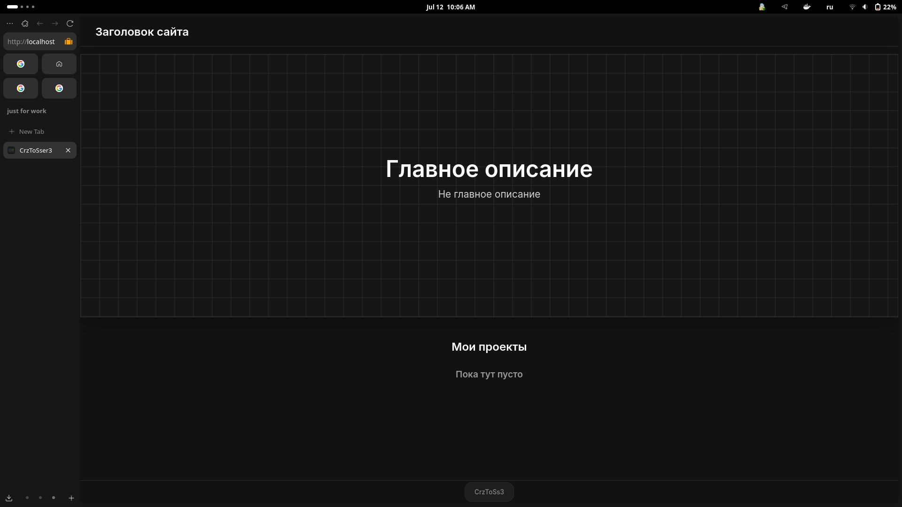

# Сайт портфолио

<p align="center">
  
</p>

---

## Описание

Это простая реализация сайта-портфолио на Django.  
На главной странице выводятся ваши проекты — при клике на них происходит переход на соответствующие репозитории GitHub.  
В подвале сайта размещается ссылка на ваш профиль GitHub.

Проект можно использовать как шаблон для создания собственного портфолио: добавляйте проекты, изменяйте внешний вид или расширяйте функциональность.


## Зависимости

Для запуска проекта понадобятся:

- Python **3.13+**
- [uv](https://github.com/astral-sh/uv) — современный и быстрый пакетный менеджер
- [Docker](https://www.docker.com/) *(необязательно, но предоставлены готовые файлы для сборки контейнеров)*


## Установка и запуск проекта

### 1. Клонируйте репозиторий

```bash
git clone https://github.com/crazy-tosser3/InfoSite.git
```

### 2. Перейдите в папку и выполните миграции базы данных и синхронизацию зависимостей

```bash
cd backend

uv sync

uv run manage.py makemigrations
uv run manage.py migrate
```

### 3. Создайте учетную запись администратора

```bash
uv run manage.py createsuperuser
```

### 4. Подготовьте файл конфигурации

В корне проекта создайте файл `.env` со следующим содержимым:

```env
SECRET_KEY = <your_secret_key>
```

Замените `<your_secret_key>` на ваш уникальный ключ Django (его можно сгенерировать через [Django Secret Key Generator](https://djecrety.ir/)).


## Запуск проекта

Есть два варианта запуска — выбирайте подходящий:

### Вариант 1: Запуск напрямую через Django

1. В `settings.py` установите `DEBUG = True`, если вы работаете в режиме разработки.

2. Запустите сервер:

   ```bash
   uv run manage.py runserver
   ```

3. Перейдите в браузере по адресу: [http://localhost:8000](http://localhost:8000)

---

### Вариант 2: Сборка и запуск через Docker

1. Убедитесь, что Docker установлен и запущен.

2. В корневой папке выполните:

   ```bash
   docker compose up -d --build
   ```

3. После успешной сборки сайт будет доступен по адресу: [http://localhost](http://localhost)


## Дополнительная информация

* Все статики и медиа файлы лежат в `backend/static/` — их можно адаптировать под свои проекты.
* Для управления проектами и данными используйте стандартную админ-панель Django по адресу [http://localhost:8000/admin](http://localhost:8000/admin).
* JSON ключи в Django для написания описания сайта: bold - главное thin - не главное
## Лицензия

Проект распространяется под лицензией **MIT**. Вы можете свободно использовать и модифицировать его под свои нужды.


## Скриншот

<p align="center">
  
</p>
